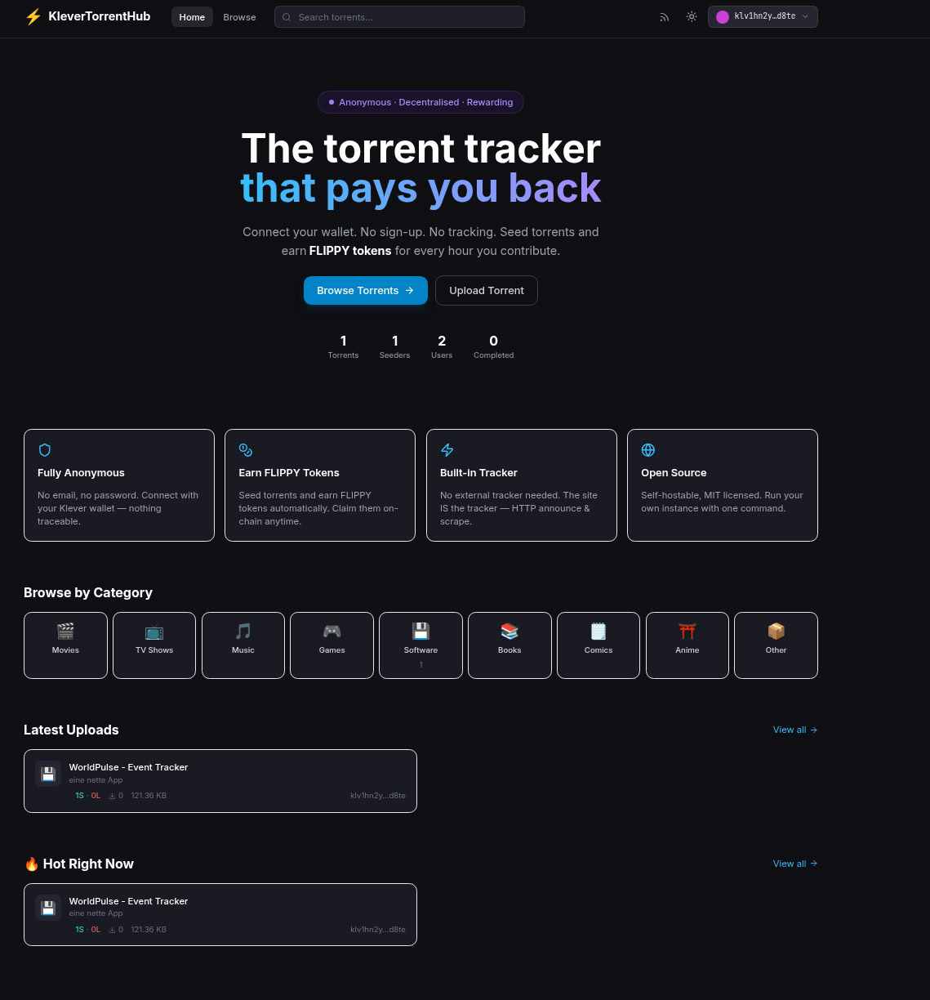
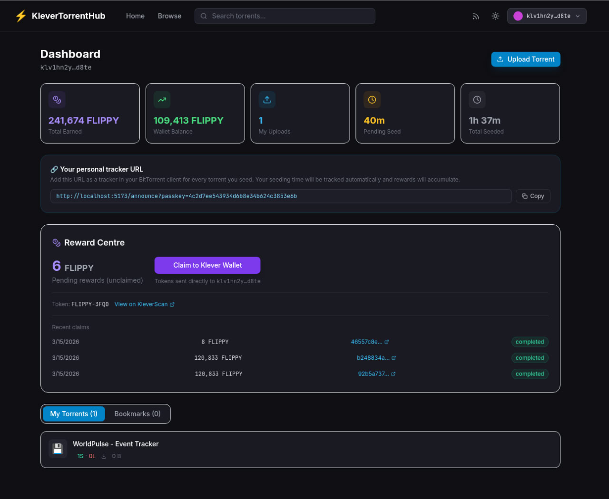

# ⚡ KleverTorrentHub

> **Anonymous, decentralised BitTorrent tracker with Klever Blockchain token rewards.**
> No email. No password. Just your Klever Wallet.

[](LICENSE)
[](https://nodejs.org)

---

## 📸 Screenshots

| Home | Dashboard |
|---|---|
|  |  |

---

## ✨ Features

| Feature | Description |
|---|---|
| 🔐 **Wallet Auth** | Sign in with Klever Wallet (Ed25519 challenge) — no accounts, no emails |
| ⚡ **Built-in Tracker** | HTTP announce + scrape endpoints built directly into the server |
| 🧲 **Magnet & .torrent** | Download via magnet link or original `.torrent` file |
| 🪙 **Token Rewards** | Earn tokens for every hour you seed — direct wallet delivery, no smart contract |
| 🗂️ **Categories** | Movies, TV, Music, Games, Software, Books, Comics, Anime, Other |
| 💬 **Comments** | Community discussion per torrent |
| 🔖 **Bookmarks** | Save torrents to your personal list |
| 📡 **RSS Feed** | `/api/meta/rss?category=movies` — subscribe with any torrent client |
| 🌙 **Dark / Light theme** | System-detected default, toggle in the header |
| ⚙️ **Admin Dashboard** | Wallet-authenticated admin panel — manage categories, moderate torrents, ban users |
| 🗄️ **SQLite default** | Zero-dependency storage — one file, no DB server needed |
| 🐘 **PostgreSQL optional** | Drop-in swap via a single env var |
| 🐳 **Docker ready** | `docker compose up` and you're live |

---

## 🔐 Anonymous Auth — How It Works

KleverTorrentHub uses **Ed25519 challenge-response** authentication:

1. Backend generates a one-time nonce
2. User signs the challenge with `window.kleverWeb.signMessage()` (Klever Extension)
3. Backend verifies the Ed25519 signature against the `klv1...` public key
4. Session token issued — no email, no password, no traceable identity

---

## 🚀 Quick Start

### Prerequisites

- **Node.js 20+**
- **[Klever Browser Extension](https://klever.io/extension)** (for using the frontend)

### 1. Clone

```bash
git clone https://github.com/your-org/klever-torrent-hub.git
cd klever-torrent-hub
```

### 2. Configure

```bash
cp backend/.env.example  backend/.env
cp frontend/.env.example frontend/.env
```

Edit `backend/.env` — the minimum required fields:

| Variable | Description |
|---|---|
| `AUTH_DOMAIN` | Your domain (e.g. `localhost` for dev) |
| `CORS_ORIGINS` | Frontend URL (e.g. `http://localhost:5173`) |
| `OWNER_WALLET` | Your `klv1...` address — gives you access to the admin panel |

### 3. Install & run

```bash
cd backend  && npm install && npm run dev
cd frontend && npm install && npm run dev
```

Open **http://localhost:5173**. The tracker is at `http://localhost:3000/announce`.

---

## 🐳 Docker Deployment

```bash
cp backend/.env.example backend/.env
docker compose up -d
```

---

## 🌐 Production Deployment (without Docker)

Sample configs for running behind a web server are in [`deploy/`](deploy/):

| File | Purpose |
|---|---|
| [`deploy/nginx.conf`](deploy/nginx.conf) | Nginx virtual host — proxies `/api` + `/announce` to Node.js, serves built frontend |
| [`deploy/apache.conf`](deploy/apache.conf) | Apache virtual host — same, using `mod_proxy` |
| [`deploy/ktorrent-hub.service`](deploy/ktorrent-hub.service) | systemd service for Debian/Ubuntu — auto-start + restart on crash |

Quick setup (Nginx + systemd example):

```bash
# 1. Build the frontend
cd frontend && npm ci && npm run build

# 2. Install the systemd service
sudo useradd -r -s /bin/false ktorrent
sudo cp deploy/ktorrent-hub.service /etc/systemd/system/
sudo systemctl daemon-reload
sudo systemctl enable --now ktorrent-hub

# 3. Install the Nginx vhost (edit domain + paths first)
sudo cp deploy/nginx.conf /etc/nginx/sites-available/ktorrent-hub
sudo ln -s /etc/nginx/sites-available/ktorrent-hub /etc/nginx/sites-enabled/
sudo nginx -t && sudo systemctl reload nginx

# 4. Obtain a free TLS certificate
sudo certbot --nginx -d yourdomain.com
```

See [`docs/SETUP.md`](docs/SETUP.md) for full details.

---

## 🪙 Token Rewards

### How it works

The backend admin wallet sends tokens directly to users' `klv1...` addresses when they claim rewards. No smart contract, no frontend transaction.

Two reward modes depending on `KTH_TOKEN_ID`:

| Mode | Config | How tokens are sent |
|---|---|---|
| **Native KLV** | `KTH_TOKEN_ID=KLV` | Transfer from admin wallet balance |
| **KDA token** | `KTH_TOKEN_ID=TICKER-XXXXXX` | AssetTrigger(Mint) — admin wallet must own or have Mint role on the token |

### Reward Flow

```
1. Upload a torrent and start seeding with your BitTorrent client
2. Add your personal tracker URL (shown in Dashboard) to your torrent client
   → your seeding activity is automatically linked to your wallet
3. Backend accumulates seed time on every tracker announce
4. Dashboard → "Claim" → tokens sent straight to your Klever Wallet
```

No manual peer registration needed — the passkey in your tracker URL does it automatically.

### Token Setup (admin, one-time)

See [`docs/SETUP.md`](docs/SETUP.md) for full token creation instructions.

Key env vars:

| Variable | Description |
|---|---|
| `KTH_TOKEN_ID` | Token ID to reward (e.g. `FLIPPY-3FQ0` or `KLV`) |
| `REWARD_TOKEN_PRECISION` | Decimal places the token was created with (default `6`, set `0` for whole-number tokens) |
| `REWARD_RATE_PER_HOUR` | Tokens per seeding hour in minimal units (`10^precision` per token) |
| `REWARD_ADMIN_MNEMONIC` | 24-word mnemonic of the admin wallet (or use `REWARD_ADMIN_PRIVATE_KEY`) |

---

## ⚙️ Admin Dashboard

The admin panel lives at **`/admin`** and is only accessible to the wallet
address set in `OWNER_WALLET`. No separate password or account is needed —
it uses the same Klever Wallet sign-in as everyone else.

### Setup (two env vars)

```bash
# backend/.env
OWNER_WALLET=klv1your_wallet_address_here

# frontend/.env  (same address — used to show/hide the admin link in the UI)
VITE_OWNER_WALLET=klv1your_wallet_address_here
```

`OWNER_WALLET` is just an address, not a private key — it is safe to set.

### What the admin can do

| Section | Actions |
|---|---|
| **Overview** | Site-wide stats, reward wallet balance, top uploaders, recent users |
| **Settings** | Enable/disable categories, set reward rate, toggle invite-only, hero/feature visibility, site name / description / announcement |
| **Torrents** | Feature ★ or unfeature, set freeleech, restore or delete any torrent |
| **Users** | Search users, ban by wallet (with optional reason) |
| **Bans** | View all active bans, lift bans |

All settings are stored in the database and take effect immediately — no server restart needed.

---

## 📁 Project Structure

```
klever-torrent-hub/
├── backend/              # Node.js + Express — API + BitTorrent tracker
│   ├── src/
│   │   ├── config/       # Central config from env vars
│   │   ├── db/           # SQLite/PostgreSQL adapters + settings store
│   │   ├── tracker/      # HTTP announce + scrape + peer store
│   │   ├── api/          # REST routes (auth, torrents, users, rewards, admin)
│   │   └── rewards/      # Seeding tracker + Klever token sending
│   └── Dockerfile
├── frontend/             # React 18 + Vite + TailwindCSS
│   ├── src/
│   │   ├── components/   # UI, Klever wallet button, torrent cards
│   │   ├── pages/        # Home, Browse, TorrentDetail, Dashboard, Submit, Admin
│   │   ├── hooks/        # useAuth, useAdmin
│   │   ├── store/        # Zustand (auth, theme)
│   │   └── lib/          # API client, klever.js (wallet helpers)
│   └── Dockerfile
├── deploy/               # Sample Nginx/Apache vhosts + systemd service file
├── docs/                 # Setup, API, and contributing docs
└── docker-compose.yml
```

---

## 🔒 Security Notes

- Auth nonces expire after **10 minutes** and are single-use
- Sessions expire after **7 days**
- `OWNER_WALLET` is just an address — not a secret. The security comes from requiring a valid wallet signature, not from keeping the address hidden
- `REWARD_ADMIN_MNEMONIC` / `REWARD_ADMIN_PRIVATE_KEY` must be a **dedicated wallet**, never a personal wallet with large funds
- Banned wallets are blocked at sign-in; existing sessions are invalidated immediately
- Rate limiting: 300 req/15 min (general), 20 req/15 min (auth)
- Helmet sets security headers on all responses

---

## 🤝 Contributing

See [`docs/CONTRIBUTING.md`](docs/CONTRIBUTING.md).

---

## 📜 License

MIT — free to use, fork, and self-host.
